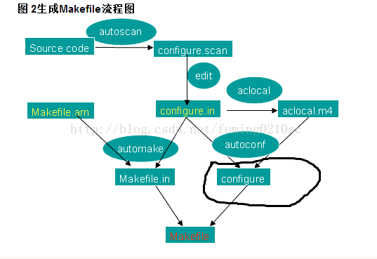

## storage
### Cpp 存储内存
* stack 局部变量、函数参数 / 系统自动分配
* heap new出来的都放在堆 / 程序员自行分配
* static 全局区，全局变量、静态数组、const
* 文字常量区 字符串
* 程序代码区域 函数体的二进制文件
###迭代器失效
* 迭代器在对象重新申请空间的时候，会失效，要重新定义（指向新的空间）
# static
* 局部静态变量保存在全局数据区，不是 stack 其他函数可以调用，赋值。

##关于 *p 指针的问题
* 其实*是一种运算符，一种乘法运算符的重载。
##delete 
* delete 本质是释放指针所指向的内存（别的代码，可以new到该地址，避免内存泄露），不是删除指针本身。
## 头文件 .h
* declaration and definition成对出现。
# 报错
## segtime 11
* 一般是越界，查找 index合理性 包括是否初始化的问题。
## I/O 问题
### cin 
* 在输出之前，（cin>>chr）输入一直存在于cin 缓存空间内
### the 'break' in switch with in the while loop 
* 不能跳出循环
* cin.fail() 默认值为 0（legal）；
## makefile
1）如果这个工程没有编译过，那么我们的所有C文件都要编译并被链接。
2）如果这个工程的某几个C文件被修改，那么我们只编译被修改的C文件，并链接目标程序。
3）如果这个工程的头文件被改变了，那么我们需要编译引用了这几个头文件的C文件，并链接目标程序。
## 关于prefix
* ./configure –prefix=/usr/local/<softwareName>
采用源码安装， configure->(生成 makefile)   利用 autoscan / **automake / autoconf** （libtool）
make （编译） make install（安装）
该软件任何的文档都被复制到这个目录。为什么要指定这个安装目录？是为了以后的维护方便，假如没有用这个选项，安装过程结束后，该软件所需的软件被复制到不同的系统目录下，很难弄清楚到底复制了那些文档、都复制到哪里去了—基本上是一塌糊涂。
用了—prefix选项的另一个好处是卸载软件或移植软件。当某个安装的软件不再需要时，只须简单的删除该安装目录，就能够把软件卸载得干干净净；移植软件只需拷贝整个目录到另外一个机器即可（相同的操作系统）。

*如果命令太长，你可以使用反斜框（‘/’）作为换行符
 
-----
# bash
    apt-cache search < package name > 
查找安装包名
# docker
* 复制
    docker cp ID全称:容器文件路径 本地路径

# Anaconda
    source activate <env_name>
### 进入环境
    conda install < package name >
    conda list 
    conda update
    conda update --all
    conda activate <contain name>
    conda deactivate
# spit
* vscode linux版本 运行不能自动保存。。。

# ssh
    service service sshd status
    查看ssh的状态
    apt-get install openssh-server
    安装sshd.service
    ssh <user name>@<公共IP> -v
    <!-- debug 过程 -->
# network
    netstat -tunlp |grep 端口号
    查看端口状态
# Nvidia 
    nvidia-smi
    查看 GPU 占用信息

## 服务器
    59.77.16.100 -p 2326

## docker 
### Dockerfile
    docker build -t < image name > .
    . 表示Dockerfile在当前目录
    docker commit <containN> <imageN>
    生成 docker_image